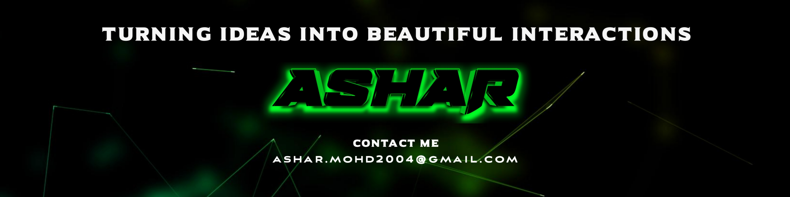

  

## 👋 About Me

I am an **Information Technology graduate** with a strong interest in **Full Stack Development, UI/UX Design, Cybersecurity, and Digital Creativity**.

I focus on building **clean, responsive, and user-friendly applications**, designing intuitive interfaces, and understanding security-conscious development practices. As a fresher, I am highly motivated, quick to learn, and eager to apply my skills to real-world projects while continuously improving both my technical and creative abilities.

---

## 🛠️ Skills

### 💻 Programming Languages

---

### 🌐 Web Development

---

### 🗄️ Databases

---

### 🎨 UI / UX & Creative Design

---

### 🎬 Editing & Motion Graphics

---

### 🔐 Cybersecurity

---

## 📜 Certifications

- Ethical Hacking — Cisco Networking Academy  
- Cybersecurity Fundamentals — IBM  
- Data Privacy Fundamentals — IBM  

---

## 📫 Connect With Me

  
  
  

